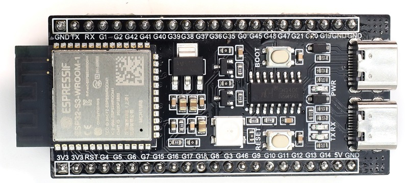
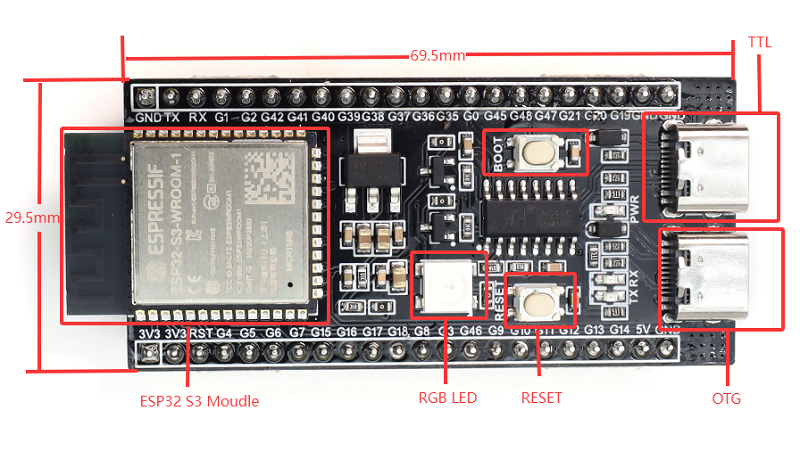
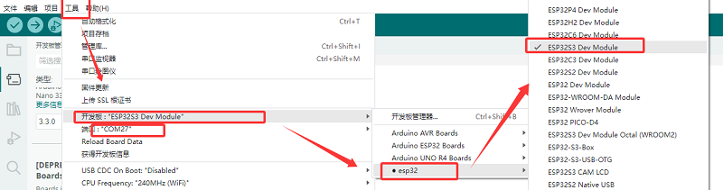
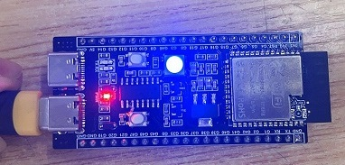

# MB0183 S3 mini



## 1. 介绍

S3 mini开发板是一款基于乐鑫ESP32 S3 WROOM-1-N16R8模组，其双核 Xtensa LX7 MCU 主频达 240MHz，内置 16MB FLASH、8MB SRAM 等存储，集成 2.4GHz Wi-Fi 与低功耗蓝牙(Bluetooth® LE)。它板载Type-C转串口，Type-C 转OTG，RGB LED，并且将GPIO口通过排针引出，两排排针的间距为25.5mm，方便开发者快速开发与实验。可应用于智能家居、工业自动化、医疗保健、消费电子、智慧农场等。

## 2. 规格参数

- 工作电压：DC3.3V
- 输入电压：DC3.3~DC5V 
- 工作电流：80mA(平均)
- ESP32模组：ESP32-S3-WROOM-1
- ​FLASH：16MB
- ​时钟频率：240MHZ
- USB转串口：采用Type C 接口，CH340C USB转串口芯片（可通过此接口下载程序）
- USB转OTG：采用Type-C接口，此接口可用于debug调试或外部挂载存储设备
- 产品尺寸：69.5*29.5mm

## 3. 接口描述


具体引脚功能可以参考[用户手册](https://www.espressif.com.cn/sites/default/files/documentation/esp32-s3_datasheet_cn.pdf)

## 4. Arduino

Arduino IDE安装请参考: [Arduino IDE](https://www.keyesrobot.cn/projects/Arduino)

### 下载
在上述Arduino IDE 安装教程中有如何安装ESP32芯片包的说明(安装的版本可以为最新版)，此处就不过多赘述。
首先我们打开下载好的Arduino IDE 软件，点击工具->开发板->esp32->ESP32S3 DEV Moudle;端口选择使用USB线与开发板后新增的端口（如未有新增串口请检查是否[安装CH340驱动](https://www.keyesrobot.cn/projects/Arduino)或更换USB线）。

随后将下列程序复制烧录到开发板即可。

```
void setup() {
  // No need to initialize the RGB LED
}

// the loop function runs over and over again forever
void loop() {
#ifdef RGB_BUILTIN
  digitalWrite(RGB_BUILTIN, HIGH);  // Turn the RGB LED white
  delay(1000);
  digitalWrite(RGB_BUILTIN, LOW);  // Turn the RGB LED off
  delay(1000);

  rgbLedWrite(RGB_BUILTIN, RGB_BRIGHTNESS, 0, 0);  // Red
  delay(1000);
  rgbLedWrite(RGB_BUILTIN, 0, RGB_BRIGHTNESS, 0);  // Green
  delay(1000);
  rgbLedWrite(RGB_BUILTIN, 0, 0, RGB_BRIGHTNESS);  // Blue
  delay(1000);
  rgbLedWrite(RGB_BUILTIN, 0, 0, 0);  // Off / black
  delay(1000);
#endif
}
```
烧录成功后，开发板上的RGB等会以“白-红-绿-蓝-熄灭”交替闪烁。

## 5. 注意事项

1.无法烧录程序到开发板？

答：请更换数据线或重新安装CH340驱动。

2.请勿直接使用IO口直接接入大功率电机。


